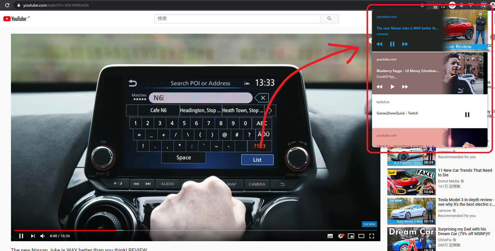
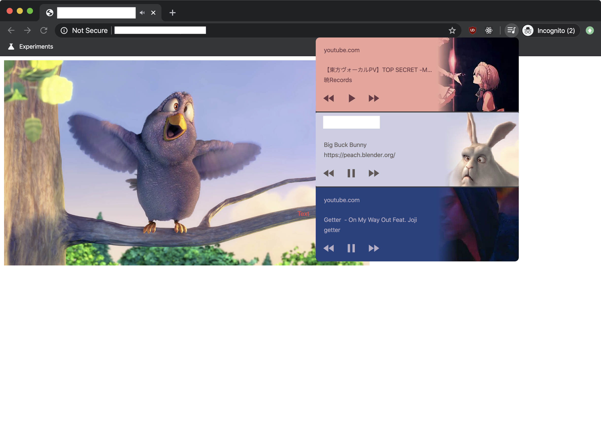

Chrome 79で最近[Global Media Controls](https://japanese.engadget.com/2019/12/23/chrome-79/)というのが有効化されるようになりました。

割と前から？テストしていたみたいですが、この記事を書いた時くらいから勝手に有効化するようになったみたいです。

Youtubeの動画を再生すると以下見たいな感じに表示されます。



基本的にはvideoやaudioの様なメディアに反応して出てくるのですが、Youtube以外は再生/停止ボタンしか出ずGoogleだからか？と思いましたが違いました。

スマホでは多分よく使われている[Media Session API](https://w3c.github.io/mediasession/)を使うとデスクトップでも情報として取ってくれます。

```html
<html>
<video src='./bbb_buny.mp4' width="720" controls autoplay></video>
<script type="text/javascript">
navigator.mediaSession.metadata = new MediaMetadata({
	title: 'Big Buck Bunny',
	artist: 'https://peach.blender.org/',
	artwork: [
		{ src: 'https://sample.com/test.jpg', sizes: '256x256', type: 'image/jpg' },
	]
})
</script>
</html>
```

メディアのコントロールを付けたい場合は`setActionHandler`にハンドラを増やして行くと良いです。

以下はvideoに対しての一例です。

```js
navigator.mediaSession.setActionHandler('play', async () => await document.querySelector('video').play())
navigator.mediaSession.setActionHandler('pause', async () => await document.querySelector('video').pause())
navigator.mediaSession.setActionHandler('seekbackward', () => document.querySelector('video').currentTime-=5);
navigator.mediaSession.setActionHandler('seekforward', () => document.querySelector('video').currentTime+=5);
```



これでYoutubeみたいに情報を表示できます。もっと細かく情報やハンドラを付けたい場合は大体スマホの話ですが、
[Google](https://developers.google.com/web/updates/2017/02/media-session?hl=ja)の解説を読みましょう。

私みたいにタブをバカみたいに開く人には良い機能かもしれませんが、邪魔だという人は `chrome://flags/#global-media-controls` から無効化できるみたいです。

Chrome OSでは前からあったみたいで、スマホのUIなどを最近デスクトップ版にも取り込むような動きみたいです。
ただ最近それに伴ってか少し少しメディア周りが重くなった気がして辛い所があります...
