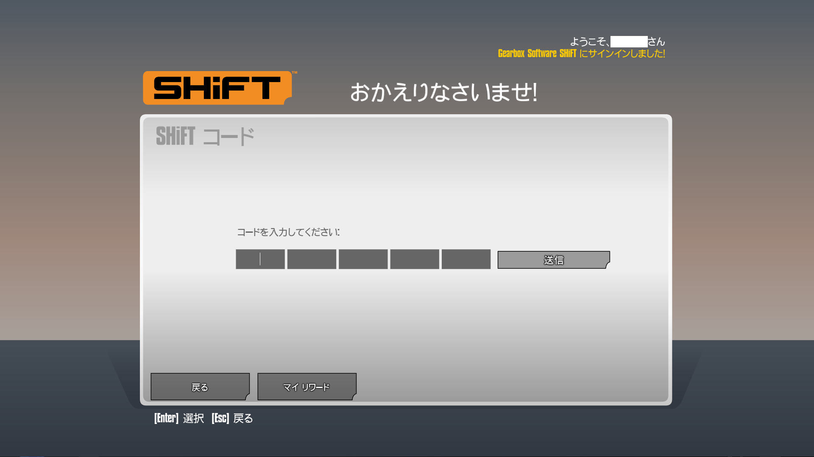

最近Steamのセールにて少し古いですが [Borderlands: The Pre-Sequel](https://store.steampowered.com/app/261640/Borderlands_The_PreSequel/) と言うゲームを購入しました。

RPG系のシューターで、ハックアンドスラッシュと呼ばれる要素がありアイテムを集めるのが重要です。

そしてこのゲームの中にはShiftコードと呼ばれる限定コードでガチャができるキーを貰えます。そこからレジェンダリー(最近のゲームでよくある高いレアリティ)なアイテムが出たりします。



しかしフォームはコピー&ペーストができません。また数年前から配布している為シリアルコードが大量に存在しており、一つずつ入力するのはとてもしんどいため自動化しました。

まず[このサイト](http://orcz.com/Borderlands_Pre-Sequel:_Shift_Codes#SHiFT_Codes)より以下のコードで無理やり使えるシリアルコードを引き出しPythonのListな文字列にしました。

```js
Array.from(document.querySelector('table').querySelectorAll('tbody tr'))
.map(e => e.querySelectorAll('td')).map(e => e[4].querySelector('span')).filter(e=> e!==null)
.filter(e=>e.style.color!=='red'||!e.hasAttribute('style'))
.map(e=>'['+ e.innerText.split('-').map(s=>`"${s}"`).join(',') + ']').join(', ')
```

これはブラウザのコンソール等で実行でき中身のテキストを取得して判断しています。

スクレイピングでもできますが、一回取ってこればいい為これで取得します。

次に、pyautoguiでの自動化ですが勝手に入力して送信するところだけをします。

前の画像の入力部分を抽出し、プログラムでそこにフォーカスをし入力していくようにします。


以下がスクリプトです。CODESに先ほど取得したキーのリストを格納します。


```py
import pyautogui

BOX_OFFSET = 125
BOXES = 5
CODES = [['5CK3B','BH5WX','T5BT3','JBT33','W3XS3'], ...] # コードをここに入れておく

if __name__ == '__main__':
	screen_x, screen_y = pyautogui.size()

	pos = pyautogui.locateOnScreen('box.png', grayscale=False, confidence=0.95)
	box_x, box_y = pos.left+10, pos.top+20

	for code in CODES:
		pyautogui.moveTo(box_x, box_y, duration=0.1)
		pyautogui.click()
		types = 0
		while True:
			pyautogui.typewrite(code[types], interval=0.01)
			types += 1
			if types >= BOXES:
				pyautogui.press('enter')
				break
		input('Press Enter to continue')
```

<video src={'/webm/autopy.webm'} width="100%" controls autoplay loop />

フォーム一つを入力すると自動で次のフォームへ移動する為、マウス移動は一度で済みます。

<video src={'/webm/unbox.webm'} width="100%" controls autoplay loop />

ガチャガチャを開ける様子

今回は面倒なキー入力だけを自動化しました。ゲームでは自動化によりBOTのようなことが出来てしまう点はありますが、良いか悪いか気を付けて行いましょう。

あとこのような自動操作させるプログラムは、マウスとキーボードをジャックするため無限ループなどで動かせなくなったりこともある為気を付けましょう。(loopの場合inなどで行うと良い。)
