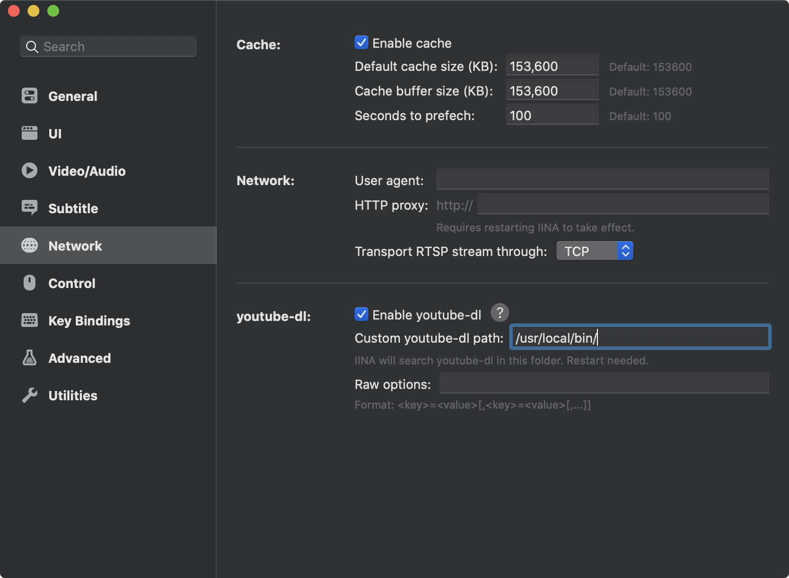

[IINA](https://iina.io/)は[mpv](https://mpv.io)をベースにしたメディアプレイヤーです。

その為mpvのようにYoutubeの生放送をそのまま再生できるかと思いましたが、できませんでした。

IINAにバンドルされているyoutube-dlのバージョンが古い為、変更する必要がありました。

youtube-dlを導入する一番楽な方法はbrewを使うことだと思います

```
$ brew install youtube-dl
```

導入したらIINAの設定を変えます。



パスですが、大抵は`/usr/local/bin/`にあると思いますが、違う場合は以下で確認してください。

```
$ which youtube-dl
```
